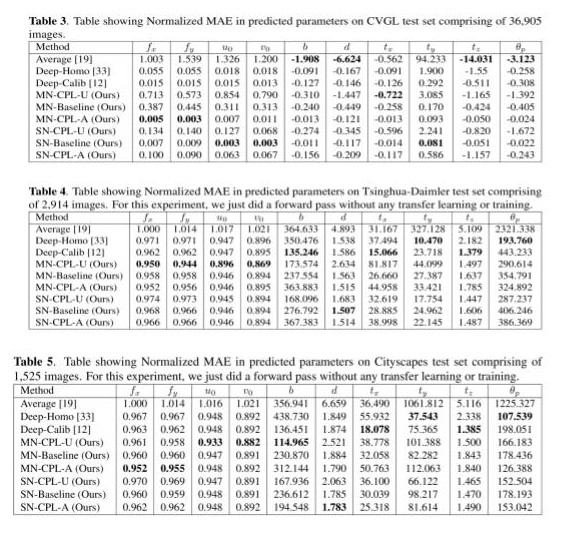

# Camera-Calibration-through-Camera-Projection-Loss and  Multi-task-Learning-for-Camera-Calibration

This repository contains code  for a conference and a journal paper

Conference: Camera-Calibration-through-Camera-Projection-Loss, https://arxiv.org/pdf/2110.03479.pdf

Journal: Multi-task-Learning-for-Camera-Calibration, https://arxiv.org/abs/2211.12432

Camera calibration is a necessity in various tasks including 3D reconstruction, hand-eye coordination for a robotic interaction, autonomous driving, etc. In this work we propose a novel method to predict extrinsic (baseline, pitch, and translation), intrinsic (focal length and principal point offset) parameters using an image pair. Unlike existing methods, instead of designing an end-to-end solution, we proposed a new representation that incorporates camera model equations as a
neural network in multi-task learning framework. We estimate the desired parameters via novel camera projection loss (CPL) that uses the camera model neural network to reconstruct the 3D points and uses the reconstruction loss to estimate the camera parameters. To the best of our knowledge, ours is the first method to jointly estimate both the intrinsic and extrinsic parameters via a multi-task learning methodology that combines analytical equations in learning framework
for the estimation of camera parameters. We also proposed a novel CVGL Camera Calibration dataset using CARLA Simulator. Empirically, we demonstrate that our proposed approach achieves better performance with respect to both deep learning-based and traditional methods on 8 out of 10 parameters evaluated using both synthetic and real data.

# Code for Camera  Calibration through Camera Projection Loss

Data_Preparation/data_preparation.ipynb converts the actual data into npy format used for experiments.

Data_Preparation/normalization_values.ipynb contains the normalization values used for evaluation.

Each model has been trained on the CVGL Camera Calibration Dataset while Tsinghua-Daimler Dataset (Real) has been used only for testing. 
Each folder contains 2 ipython notebooks, one for CVGL Dataset while the other for Tsinghua-Daimler Dataset (Real).

# Code for Multi-task Learning  for Camera Calibration

## Cityscapes Dataset has been added for evaluation

Data_Preparation/data_preparation_cityscapes.ipynb converts the actual data into npy format used for experiments.

Data_Preparation/normalization_values_cs.ipynb contains the normalization values used for evaluation.

Each folder contains a file ending with cs representing cityscapes dataset

# Weights and Logs for Camera Calibration through Camera Projection Loss

All weights and  logs are  available here:  https://drive.google.com/drive/folders/1zvahfHx6pJo1x9lU916U9Ocr0_pamZ1r?usp=share_link

# Weights and Logs for Multi-task Learning for Camera Calibration

All the  weights are availale here: https://drive.google.com/drive/folders/1cvF7jmqoqrdkCRqThOfpDc-FCLi2_nt5?usp=share_link

# Datasets

CVGL Camera Calibration Dataset without preprocessing: https://drive.google.com/drive/folders/1Y7B-6ifXiVao4p0HXC5wBBQOevSOZ8ps?usp=share_link

CVGL Camera Calibration Dataset format used for experiments: https://drive.google.com/drive/folders/1hFhtd6cmcxK5_GjfuzzBa4OAazEzgZwp?usp=share_link

Tsinghua-Daimler Dataset (Real Dataset): http://www.gavrila.net/Datasets/Daimler_Pedestrian_Benchmark_D/Tsinghua-Daimler_Cyclist_Detec/tsinghua-daimler_cyclist_detec.html

Tsinghua-Daimler Dataset format used for experiments: https://drive.google.com/drive/folders/1hFhtd6cmcxK5_GjfuzzBa4OAazEzgZwp?usp=share_link

Each file name ending with r represents Tsinghua-Daimler Dataset

Cityscapes Dataset (Real Dataset): https://www.cityscapes-dataset.com

Cityscapes Dataset format used for experiments: https://drive.google.com/drive/folders/1hFhtd6cmcxK5_GjfuzzBa4OAazEzgZwp?usp=share_link

Each file name ending with cs represents Cityscapes Dataset

# CVGL Camera Calibration Dataset

The dataset has been collected using the CARLA Simulator gear server available here: https://drive.google.com/file/d/1X52PXqT0phEi5WEWAISAQYZs-Ivx4VoE/view

The data collector used is available here: https://github.com/carla-simulator/data-collector

The dataset consists of 50 camera configurations with each town having 25 configurations. The parameters modified for generating the configurations include f ov, x, y, z, pitch, yaw, and roll. Here, f ov is the field of view, (x, y, z) is the translation while (pitch, yaw, and roll) is the rotation between the cameras. The total number of image pairs is 1,23,017, out of which 58,596 belong to Town 1 while 64,421 belong to Town 2, the difference in the number of images is due to the length of the tracks.

For each episode, there is a file named params.txt containing the following parameters: fov, x, y, z, pitch, yaw, roll.

Focal Length is computed as follows: img_size[0]/(2 * np.tan(fov * np.pi/360))

U0 and V0 are computed as: img_size[0]/2

Baseline is equal to the translation in x-axis.

Disparity value is computed using the following:

stereo = cv2.StereoBM_create(numDisparities=16, blockSize=15)

disparity_map = stereo.compute(l_im, r_im)

disparity_value = np.mean(disparity_map)

xcam, ycam, zcam are computed as follows:

xcam = (focal_length * x) / disparity_value
 
ycam = - (xcam / focal_length) * (5 - U0)
                
zcam = (xcam / focal_length) * (V0 - 5)

xworld, yworld, zworld are computed as follows:

yworld = ycam + y

xworld = xcam * math.cos(pitch) + zcam * math.sin(pitch) + x

zworld = - xcam * math.sin(pitch) + zcam * math.cos(pitch) + z

Left Camera was  constant at the following configuration:

X = 2
Y = 0
Z = 1.4
Pitch = -15

Right Camera Configurations:

FOV with range from 50 to 150

X with range from 2 to 170

Y with range from -5 to 5

Z with range from 1 to 3

Pitch with range from -30 to 30

While making the dataset, we used the values as the difference between left and right camera. e.g. the value for X for first episode is 0.

# Results from Camera Calibration through Camera Projection Loss

<div align="center">
     
</div>

# Results from  Multi-task Learning for Camera Calibration

<div align="center">
     
</div>

Some related articles are as follows:

How I got my MS Thesis Idea: https://thanifbutt.medium.com/how-i-got-my-thesis-idea-b64160a04d47

CVGL Camera Calibration Dataset: https://thanifbutt.medium.com/fast-lums-camera-calibration-dataset-98363918fcf6

Camera Calibration through Camera Projection Loss: https://thanifbutt.medium.com/camera-calibration-through-camera-projection-loss-e704ae6dbb29

# Citation for Camera Calibration through Camera Projection Loss

```
@article{butt2021camera,
  title={Camera Calibration through Camera Projection Loss},
  author={Butt, Talha Hanif and Taj, Murtaza},
  journal={arXiv preprint arXiv:2110.03479},
  year={2021}
}
```

# Citation for Multi-task Learning for Camera Calibration

```
@article{butt2022multi,
  title={Multi-task Learning for Camera Calibration},
  author={Butt, Talha Hanif and Taj, Murtaza},
  journal={arXiv preprint arXiv:2211.12432},
  year={2022}
}
```

